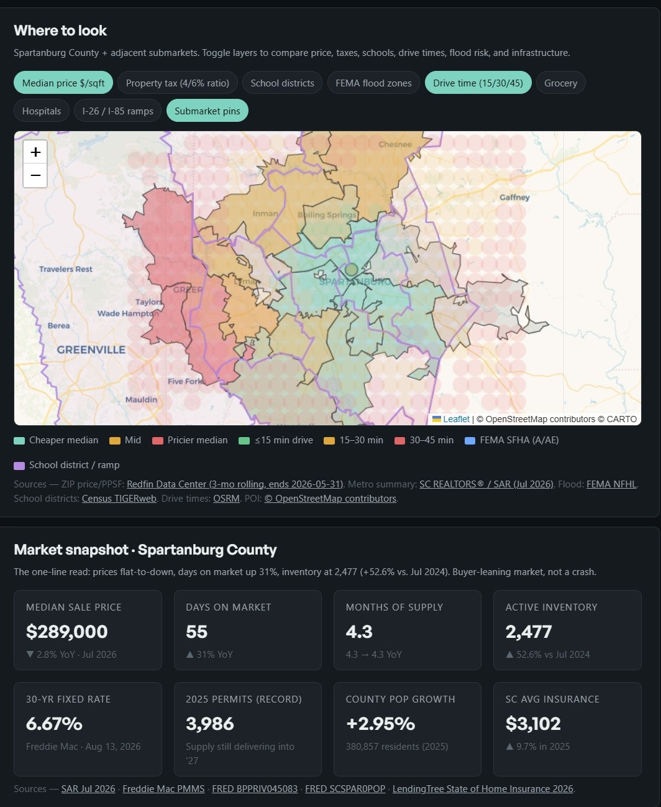

# Home-Buying Decision Dashboard

A single-page decision tool that turns a home-buying question into a structured, source-cited answer. Built to demonstrate how I use AI as a research force multiplier — not as a decision-maker — for a real-world, high-stakes decision.

**Live:** 
[https://flux1618.github.io/home-buying-dashboard](https://flux1618.github.io/home-buying-dashboard)

<a href="docs/dashboard-full.jpg">See the full page</a> — map, affordability engine, submarket scorecard, timing signals, property scorer, and cash-flow runway.

---

## Use case/user story: Why I built this

Life is full of change and since I'm moving from North Carolina to the Spartanburg, SC area, my partner and I wanted to plan on buying a house within 1-2 years, maybe around Q2-Q3 2027 or 2028. Because I need data to make informed decisions, I needed a tool with the following requirements:

1. Compare 10 submarkets on the same axes without opening 40 tabs.
2. Keep every number created sourced.
3. Separate empirical data from estimations.
4. Challenge my intuition with an invalidation case, before committing to a sub market.

Because I understand that Zillow, Redfin, and other websites optimize for engagement, I simply wanted to pull their data to make actionable **decisions**.

---

## UX/functionality: How to use

Move the sliders. Every KPI recomputes live.

- **Interactive map** — Spartanburg County + adjacent submarkets. Toggle layers for median price, work commute time isochrones (15/30/45 min), FEMA flood zones, school districts for long-term plans, grocery, hospital, highway-ramp POIs.
- **Affordability engine** — PITI, front-end DTI, cash to close. Uses SC's 4% owner-occupied assessment ratio and Act 388 school-operating exemption.
- **Rent versus buy breakeven points** — accounts for opportunity cost on the down payment. Sensitivity via appreciation and investment-return sliders.
- **Submarket scorecard** — 10 submarkets scored on price, leverage, commute, safety, and fiber connectivity for my home needs. Reweight in the sidebar and watch the ranking change.
- **Timing signals** — nine market watch-items with better/worse thresholds and links to their primary sources.
- **Property scorer** — enter a hypothetical listing, get a 0–100 fit score against your hard rules and a red-flag checklist. Functionality will be improved later on since the ideal workflow for me is to mark MLS homes that I have favorited and then later will be pulled and scored in a spreadsheet style.
- **Cash-flow runway** — This will determine whether or not we will hit our down payment using our financial data pulled from Monarch in our personal investment plan.

Everything is a single `index.html` + `app.js` + `data.json`. No backend, build step, or dependencies beyond Leaflet and Chart.js from CDN.

---

## Rationality and Logic for the financial and logistical aspects behind this tool

The dashboard respects the principle from a trading book: define invalidation before entry. Every submarket has a specific signal that would invalidate or prove that is a bad buy. The top 2 picks have conditions to determine whether or not to walk away. Secondly, there will be five decisions ordered based on their next steps, and not priority.

Project management discipline informed me that, since buying a house is a one-time, high-stakes deal the priority is selectivity structure, and risk management. Furthermore, since the transition from apartment to house is relatively easy, the transition from house to another house is a lot less compelling due to the need to sell the house and plan a move with more items.

---

## Data Source

Every number generated must have a pointer to an actual source, otherwise we will be making uninformed decisions.

| Layer | Source |
|---|---|
| ZIP-level median price, $/sqft, DoM, inventory | [Redfin Data Center](https://www.redfin.com/news/data-center/) (3-mo rolling ending 2026-05-31) |
| Metro summary (months supply, inventory, YoY) | [Spartanburg Association of Realtors](https://scr.stats.showingtime.com/docs/mmi/x/MarketActivityfortheSpartanburgAssociationofREALTORS) |
| 30-yr mortgage rate | [Freddie Mac PMMS](https://www.freddiemac.com/pmms) |
| County population | [FRED SCSPAR0POP](https://fred.stlouisfed.org/data/SCSPAR0POP.txt) |
| Residential permits | [FRED BPPRIV045083](https://fred.stlouisfed.org/data/BPPRIV045083.txt) |
| SC insurance average | [LendingTree](https://www.lendingtree.com/insurance/state-of-home-insurance/) |
| Tax mechanics (Act 388) | [SC DOR](https://dor.sc.gov/lgs/property-tax-basics) |
| Property assessment / reappraisal | [Spartanburg County Auditor](https://www.spartanburgcounty.gov/171/Auditor) |
| Flood zones | [FEMA NFHL](https://msc.fema.gov/portal/home) |
| School district boundaries | [Census TIGERweb](https://tigerweb.geo.census.gov/) |
| ZIP boundaries | [OpenDataDE SC ZCTAs](https://github.com/OpenDataDE/State-zip-code-GeoJSON) |
| Drive-time routing | [OSRM public router](https://project-osrm.org/) |
| POI (grocery, hospital, ramps) | [OpenStreetMap Overpass](https://overpass-api.de/) |
| BMW employment | [BMW Press](https://www.press.bmwgroup.com/usa/) |
| SC WARN filings | [SC Dept of Employment & Workforce](https://www.dew.sc.gov/) |

Estimates (typical millage, generic fiber coverage, forecast paths) are labeled inline to clarify that they are estimates.

---

## Leveraging AI and keeping my vision intact

**How I setup my requirements:**
- The constraints (commute anchor, HOA ceiling, fiber requirement, price target, 20 minute drive rule)
- The framework (define invalidation, rank then invalidation criteria, decisions ordered stepwise)
- determining what sources to trust and what submarkets to include.
- the framing of the five decisions needed in the importance of challenging intuition, as to avoid a reliance on AI making decisions

**What AI was best for:**
- Pull primary source data across 10 submarkets in parallel
- Compute commute time isochrones from an OSRM grid
- Compile Redfin, crime, broadband, and routing data into a single normalized `data.json`
- Write the HTML/JS scaffolding (I reviewed and edited)
- Screenshot-test the layout at multiple viewports before publishing

Setting constraints and making decisions keeps me in charge, while AI is best for pulling repetitive tasks, and human-error-prone tasks.

---

## Technical details

- Single-file static site. Loads in under 1s over cable.
- Leaflet 1.9.4 for the map, Chart.js 4.4.4 for the two charts. Both from CDN.
- 893 KB `data.json` payload precompiled from the primary sources. Regenerated by `tools/build_snapshot.py` and `tools/build_hazard_snapshot.py` when the underlying data refreshes.
- Fontshare Satoshi + General Sans, inline SVG logo (though I wouldn't mind Helvetica Neue), dark-mode default with light-mode toggle.
- Works offline once loaded (map tiles cache).

---

## how to translate into career and work

My personality is defined as someone who thinks deeply about self improvement and constant optimization even for the mundane stuff in my life. How this applies to this tool is:

1. Define what decision I need to make.
2. Define the requirements, and explicit no go.
3. Define how to retrieve data, and avoid secondhand errors due to being lost in translation (eg, using opinions or aggregated data)
4. Normalizing data with every number value source sourced.
5. Scoring candidates with adjustable weights.
6. Having an invalidation criteria.
7. Ordering next steps based on logical timeline

That's a repeatable workflow for me, that is open to change, but has utility when it comes to things like:  vendor selection, tool choice, migration planning, or any decision where there is a high noise to signal ratio.

## To Do
1. Amortization calculator
2.  Actual pipeline with normalized data storage on repo
3. Regenerating nightly data in data/parcels.parquet with Github actions. county REST service, return tax pin, assessed value, tax district, school attendance zone, and last sale
4. rate sensitivity band that plot at the same houses with 5.0% to 7.5% with 30 year at 6.5% that includes  oscillation within a few base points weekly, defining the payment delta to inform buy or wait decision
5. Watcher to push notifications
6. Natural language evaluation to query on tool
7. Market velocity
8. open API for spartanburg area GIS, that includes parcels, assessed values, service districts, and voting/school boundaries
9. FRED  MORTGAGE30US , the Freddie Mac 30-year average, weekly each Thursday, free API key

Built and removed from this list: the scenario solver ([ADR 0010](docs/adr/0010-inverse-affordability-is-two-answers.md)) and the SC 4% vs 6% assessment ratio with the school operating millage removed for legal residence.

## To Do Roadmap

### Phase 1 — "Analyze a Property" vertical slice

Goal: Paste an Address or listing -> receive a proper report with results and sources

1. ~~Geocode the address.~~ **Done.**
2. ~~Compute **full cost of ownership**, not just PITI — corrected 4% vs. 6% assessment ratio, actual district millage, insurance, maintenance reserve, HOA.~~ **Done.**
3. ~~Pull **FEMA National Risk Index** for the tract.~~ **Done** — 18 hazards, reported as caveats and never deducted ([ADR 0009](docs/adr/0009-hazard-risk-is-a-caveat.md)).
4. Compute a **rush-hour commute** to the work anchor, not a free-flow estimate — isochrone polygons over the I-85 / I-26 pinch points.
   **Partly done.** Free-flow OSRM time multiplied by a stated 1.25 congestion allowance, labeled an estimate with the multiplier written into the note. That multiplier is an assumption, not a measurement — isochrones are not built.
5. Verify **broadband** at the address against the SC broadband map.
   **Partly done.** The FCC station is written but needs an API key it does not have, so it returns 401 and fiber stays unknown. Census-block precision, never address-level, and provider-reported either way.
6. ~~Return a 0–100 score where **every value is stamped with its source and retrieval date.**~~ **Done** — every value carries source and retrieval date ([ADR 0002](docs/adr/0002-pure-scoring-core.md)).

This covers four reasonable criteria and will be useful for touring. 

### Phase 2 — LLM document analyzer

Goal: Paste an inspection, HOA bylaws and seller disclosure -> structured JSON, important to keep AI from any math. 

### Phase 3 — ~~Saved-property backend~~ Done

~~Per-user state: shortlist, notes, price-change history, decision journal entries. Only built once houses have been combed through for what we like aesthetically.~~

**Done** — append-only SQLite ledger ([ADR 0011](docs/adr/0011-ledger-is-append-only-and-separate.md)). Shortlist with status, full analysis history, price and score deltas, and a decision journal where an outcome closes the assumption it settles. Reachable by `python -m ledger.cli` and ten `/ledger` endpoints; **no web UI yet**, so the static page still knows nothing about it. Built earlier than planned because a price change is only visible if something recorded the old price.

### Phase 4 — Ongoing monitoring

1. Amortization calculator and ~~scenario solver~~

Goal: Be able to put in house with variables for down payment, rate, insurance, HOA dues, fees in, and calculate monthly PITI and max price under a DTI ceiling out.

**Solver done** — max price is bisected over the real cost engine and returns two answers, a lender price and a household price ([ADR 0010](docs/adr/0010-inverse-affordability-is-two-answers.md)). **Amortization schedule not built**: there is a payment formula, not a table of 360 payments.

2. Graphical rate sensitivity band

Goal: Visualize 5.0% - 7.5% rates against the same house, and quantify a wait vs buy payment delta.

3. Nightly `data/parcels.parquet` from Spartanburg County GIS Rest service - pull tax PIN, assessed value, tax district, school attendance zone, last sale.

Goal: Have it automatically update and see how we can use tax code to our advantage.

4. Weekly pulls of FRED `MORTGAGE30US` weekly pull (Thursdays).

5. Market Velocity Metrics

6. Additional Features, but not necessary:
 - Natural-language query over dataset.
 - Discord Webhooks alerts on price drops and new matches, with reminders to check tasks

### Permanent stretch goals (not planned)

- Zillow / Redfin listing extraction — terms prohibit it.
- MLS integration — requires an agent relationship.

---

## License

MIT License, feel free to adapt to your needs. Message me if you'd like help and if you build something on top of it, I'd love to see!

---

## Not financial advice

This is a personal decision-support tool built as a portfolio piece. Every value on the page is real and cited, but nothing on this dashboard is investment advice or a recommendation to buy or sell real estate. Verify every estimate on a specific TMS or address before you commit capital.
